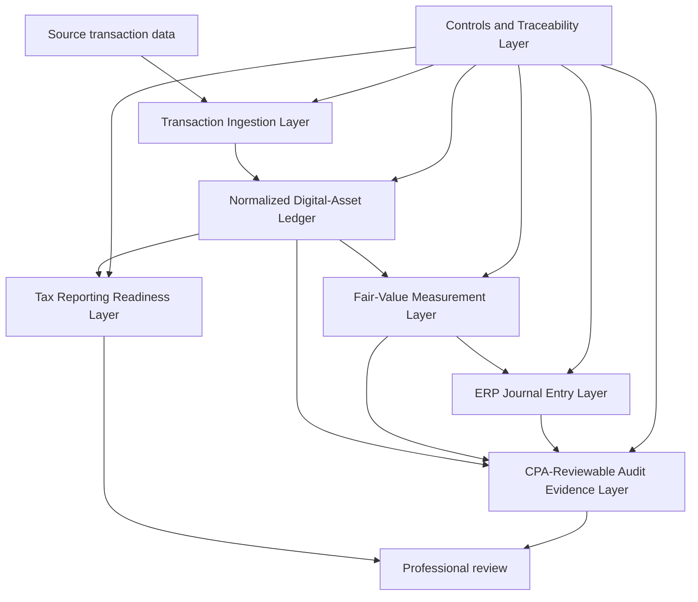

# Architecture

This document describes the intended modular architecture for an ERP-native digital-asset accounting and compliance support framework. The current repository includes the `crypto_payment_sync` Odoo module as a reference implementation for transaction and payment synchronization. Other layers are documented as an implementation pathway unless code exists for them in the repository.

## Transaction Ingestion Layer

The ingestion layer receives or imports digital-asset transaction records from external providers, payment workflows, exchange exports, or manually prepared source files. In this repository, `crypto_payment_sync` demonstrates Odoo models and controllers for payment-provider configuration, wallet records, transaction references, callback handling, and payment-related transaction records.

Expected outputs are source transaction records with stable identifiers, timestamps, asset symbols, quantities, counterparties or addresses when available, and source-system references.

## Normalized Digital-Asset Ledger

The normalized ledger converts source records into a consistent internal shape for review. It should preserve source identifiers while separating accounting fields, transaction metadata, wallet/network details, and reconciliation status.

The ledger is not a final tax ledger by itself. It is a structured working layer designed to support accounting review, cost-basis analysis, and audit evidence preparation.

## Fair-Value Measurement Layer

The fair-value layer is intended to support FASB ASU 2023-08 workflows by recording valuation dates, units held, fair-value sources, source timestamps, and calculated unrealized gains or losses.

Any fair-value record should be traceable to a documented price source and reviewed by qualified accounting professionals before use in financial reporting.

## ERP Journal Entry Layer

The journal-entry layer prepares Odoo-native accounting entries or draft entry support rows from normalized transaction and valuation records. It should preserve links to source transaction IDs, fair-value records, review status, and preparer/reviewer notes.

Draft journal-entry outputs are support materials. Posting decisions remain subject to entity-specific accounting policy and professional review.

## CPA-Reviewable Audit Evidence Layer

The audit evidence layer packages source records, transformation logs, fair-value support, reconciliation status, and reviewer notes into a structured evidence set. The goal is to make review easier and more traceable, not to replace audit procedures or professional judgment.

## Tax Reporting Readiness Layer

The tax reporting readiness layer maps normalized records to fields and reconciliation concepts relevant to IRS Form 1099-DA and Form 8949 support. It does not file returns and does not connect to IRS systems.

Outputs should be described as readiness files, field-mapping support, or reconciliation support schedules.

## Controls and Traceability Layer

Controls and traceability apply across the architecture. Expected controls include source ID preservation, deduplication checks, timestamp capture, reviewer status fields, restricted credential handling, and clear separation between demonstration data and real records.
